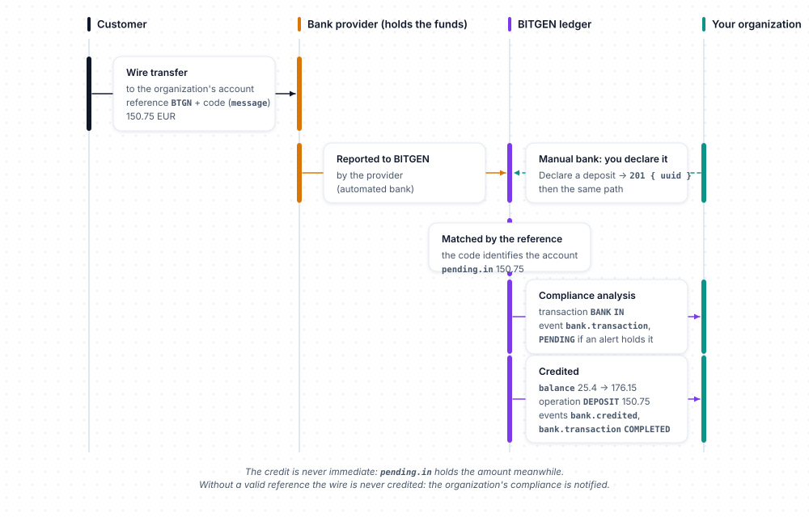

# Bank accounts

Every customer has an EUR account on the BITGEN platform: a **ledger** of the EUR they hold with the bank provider of your organization — the provider receives their bank transfers and pays their withdrawals to their IBAN, BITGEN keeps the account and notifies you ([Following a deposit and a withdrawal](../concepts.md#following-a-deposit-and-a-withdrawal)). The balance pays their purchases and is credited by their sales. `$client->bank` reads the account and its operations, withdraws EUR, and declares deposits.

Examples use `$client`, a configured `BitgenClient` ([Configuration](../configuration.md)), and `$customer`, the `Created` returned by `$client->customer->create()`. A customer is designated by a `UserRef`: their uuid, or a model carrying it ([User references](../concepts.md#user-references)). The customer must belong to your organization and be activated, otherwise the API answers `404 unknown_bank` ([Activation and identity](../concepts.md#activation-and-identity)).

## Methods

| Method | What it does | Returns |
|---|---|---|
| `get($user)` | Reads the EUR account of a customer — creates it on first read | `BankAccount` |
| `operations($user, ...)` | Lists the EUR operations of a customer | `Page<BankOperation>` |
| `withdraw($user, $amount, ...)` | Withdraws EUR to the customer's IBAN | `BankWithdrawal` |
| `credit($amount, ...)` | Declares an EUR deposit received on a manual bank provider | `Created` |

Models of this resource, under `Bitgen\Sdk\Model`: `BankAccount`, `BankPending`, `BankOperation`, `BankWithdrawal`, `Created` — the constant class `BankDirection`, and the shared `History`.

## Get

```
$client->bank->get(UserRef $user): BankAccount
```

The account is created on first read — if your organization uses BITGEN's identity verification, the customer's identity must be validated first ([Activation and identity](../concepts.md#activation-and-identity)). The `message` of the account is the reference the customer must indicate on their bank transfers.

```php
<?php

$account = $client->bank->get($customer);

// 1. Give the customer the reference to put on their wire transfer
echo $account->message, PHP_EOL;   // BTGN-4242

// 2. Once the transfer is received, the balance is credited
echo $account->balance, PHP_EOL;   // 150
echo $account->pending->in, ' ', $account->pending->out, PHP_EOL;   // 0 0
```

Returns a `BankAccount`:

| Property | Description |
|---|---|
| `uuid` | The account |
| `message` | The wire transfer reference the customer must indicate (`BTGN` prefix) |
| `iban`, `bank`, `bic` | The customer's bank details, `null` until set — `withdraw` can set them |
| `balance` | EUR balance (`float`) |
| `pending` | `BankPending`: `in` (reported deposits not credited yet — BITGEN processing and compliance analysis), `out` (withdrawals requested and purchase reserves, not settled yet) |
| `history` | EUR balance curve, a `History` ([Timestamps and histories](../concepts.md#timestamps-and-histories)) — `null` until the hourly computation has run for this account |

## Operations

```
$client->bank->operations(UserRef $user, ?string $direction = null, ?int $from = null, ?int $to = null, ?int $offset = null, ?int $limit = null): Page<BankOperation>
```

| Argument | Type | Description |
|---|---|---|
| `direction` | `?string` | `BankDirection::ALL` (default), `DEPOSIT`, `WITHDRAWAL`, `PURCHASE` or `SELL` — anything else is refused before any request |
| `from`, `to` | `?int` | Epoch seconds; both together, otherwise ignored |
| `offset`, `limit` | `?int` | [Pagination](../concepts.md#pagination) |

```php
<?php

use Bitgen\Sdk\Model\BankDirection;

$page = $client->bank->operations($customer, direction: BankDirection::DEPOSIT, from: 1700000000, to: 1702592000, limit: 50);

foreach ($page->items as $operation) {
    echo $operation->date, ' ', $operation->direction, ' ', $operation->amount, PHP_EOL;   // 1701000000 DEPOSIT 150
}
```

Returns a page of `BankOperation`: `txId` (identifier of the ledger entry), `amount` (EUR, `float`), `direction` (`BankDirection::DEPOSIT`, `WITHDRAWAL`, `PURCHASE` or `SELL` — a string), `date` (epoch seconds), `info` (free label of the operation — for instance the asset bought or sold — or `null`).

## Withdraw

```
$client->bank->withdraw(UserRef $user, string|int|float $amount, ?string $iban = null, ?string $bank = null, ?string $bic = null): BankWithdrawal
```

| Argument | Type | Description |
|---|---|---|
| `amount` | `string\|int\|float` | EUR, rounded to 2 decimals by the API ([Amounts](../concepts.md#amounts)) |
| `iban`, `bank`, `bic` | `?string` | Optional: update the customer's bank details before the withdrawal |

```php
<?php

$withdrawal = $client->bank->withdraw($customer, '50.00', iban: 'FR76…', bic: 'BNPAFRPP');   // the bank details are optional once set

echo $withdrawal->transaction, PHP_EOL;   // the uuid of the transaction created for the withdrawal
```

The withdrawal goes to the customer's IBAN: the amount is reserved in `pending.out` and debited from the balance when the provider confirms the wire; the event `bank.debited` reports it then, with `amount`, `fee` and `net` — what the customer receives ([Following a deposit and a withdrawal](../concepts.md#following-a-deposit-and-a-withdrawal)). The account must have bank details (`412 bank_rib_required`), a sufficient balance (`416 requested_amount_error`) and an amount above the fee (`416 amount_below_fee`). Returns a `BankWithdrawal`: `transaction`, the identifier of the withdrawal — its `Transaction` in the journal ([Transactions](transaction.md)).


## Credit

```
$client->bank->credit(string|int|float $amount, ?UserRef $user = null, ?string $message = null, ?string $reference = null, ?string $currency = null): Created
```

`credit` only applies when your organization's bank provider is **manual** — deposits are not reported to BITGEN automatically: you tell BITGEN a wire has arrived on the organization's account. The amount enters `pending.in`, goes through BITGEN's processing and the compliance analysis, and the account is credited then — `bank.credited` at that moment ([Following a deposit and a withdrawal](../concepts.md#following-a-deposit-and-a-withdrawal)). With an automated provider, deposits are detected and credited automatically and you are notified by the `bank.credited` webhook — do not call `credit`: the API refuses it (`412 deposit_reported_by_provider`). The account is designated either by the customer (`user`) or by the wire transfer reference of the account (`message`).

| Argument | Type | Description |
|---|---|---|
| `amount` | `string\|int\|float` | EUR ([Amounts](../concepts.md#amounts)) |
| `user` | `?UserRef` | The customer, by uuid or by model — or `message` |
| `message` | `?string` | The wire transfer reference of the account (`BTGN…`) — or `user` |
| `reference` | `?string` | The bank's transfer reference — it makes the call idempotent: calling twice with the same reference declares once (and returns the same `uuid`) |
| `currency` | `?string` | Optional, `EUR` |

```php
<?php

$deposit = $client->bank->credit(
    '100.00',
    user: $customer,
    reference: 'BANK-TRANSFER-REF-42',   // the bank's transfer reference: credited once, however many times it is sent
);

echo $deposit->uuid, PHP_EOL;
```

Returns a `Created`: the `uuid` of the declared deposit — the incoming movement, not credited yet. Without `user` nor `message`, the API answers `400 bank_target_required`.



## Errors

In addition to the [common errors](../errors.md#common-errors):

| Status | `errorCode` | Meaning |
|---|---|---|
| `400` | `invalid_amount` | The amount is not valid |
| `400` | `bank_target_required` | `credit` without `user` nor `message` |
| `400` | `invalid_currency` | `credit` with a currency other than `EUR` |
| `403` | `user_actions_disabled` | Customer actions are disabled for your organization (`user_can_actions` flag) |
| `404` | `unknown_bank` | The customer is not an activated member of your organization, or the account was not found |
| `404` | `unknown_organization` | `credit`: the organization is unknown |
| `412` | `owner_identity_not_validated` | Your organization uses BITGEN's identity verification and the customer's identity is not validated: the account cannot be created |
| `412` | `bank_rib_required` | `withdraw` without an IBAN or a bank on the account |
| `412` | `ramp_not_enabled` | The `RAMP` (bank) connector of your organization is not enabled |
| `412` | `deposit_reported_by_provider` | `credit` on an automated bank provider: deposits are reported by the provider itself |
| `412` | `trading_not_enabled` | The `TRADING` connector of your organization is not enabled |
| `416` | `requested_amount_error` | Insufficient balance |
| `416` | `amount_below_fee` | The amount does not cover the fee |
| `422` | `invalid_iban` | The IBAN is not valid |
| `423` | `account_frozen` | The customer's account is frozen |
| `423` | `blocked_by_alert` | An active compliance alert blocks the customer |
| `423` | `bank_lock_unavailable` | The account is locked by a concurrent operation (creation, withdrawal) |

## Related

- [Following a deposit and a withdrawal](../concepts.md#following-a-deposit-and-a-withdrawal) — who holds the funds, what the ledger shows, when the events are sent
- [Amounts](../concepts.md#amounts) — EUR and crypto amounts, minimums
- [Customers](customer.md) — the customer the account belongs to
- [Trading](trading.md) — purchases paid from the EUR balance, sales credited to it
- [Transactions](transaction.md) — the journal where withdrawals appear
- [Webhooks](webhooks.md) — `bank.credited`, `bank.debited`, `bank.transaction`
