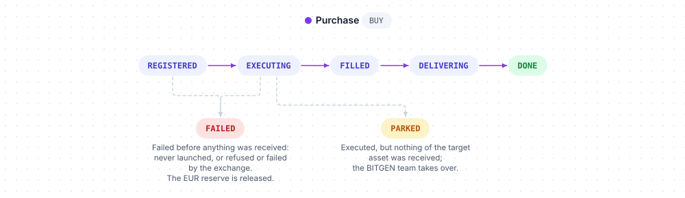
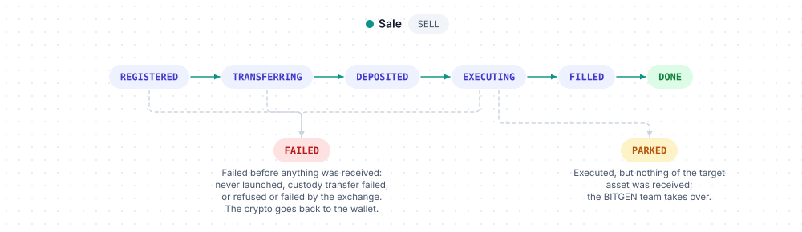

# Trading

Trading buys crypto for a customer with the EUR of their bank account, and sells crypto from their custody wallets, through the exchange of the platform. `$client->trading` places purchases and sales, reads an order and lists the orders of your organization.

Examples use `$client`, a configured `BitgenClient` ([Configuration](../configuration.md)), and `$customer`, the `Created` returned by `$client->customer->create()`. The customer of an order is designated by a `UserRef` — their uuid, or a model carrying it, not an email ([User references](../concepts.md#user-references)) — and must be an `ENABLED` member of your organization: a customer who has not activated their account is refused with `403 user_not_in_scope` ([Activation and identity](../concepts.md#activation-and-identity)).

## Methods

| Method | What it does | Returns |
|---|---|---|
| `buy($user, $asset, $amount, ...)` | Buys crypto with EUR from the customer's bank account | `OrderCreated` |
| `sell($user, $asset, $amount, ...)` | Sells crypto from the customer's custody wallet | `OrderCreated` |
| `get($order)` | Reads one order | `Order` |
| `list(...)` | Lists the orders of your organization, optionally filtered by customer, side and asset | `Page<Order>` |

Models of this resource, under `Bitgen\Sdk\Model`: `Order`, `OrderCreated`, `OrderUser`, `OrderOrganization`, `AssetRef` — and the constant classes `OrderState`, `OrderSide`, `TradingDirection`.

## Buy

```
$client->trading->buy(UserRef $user, string|Model\Asset|AssetRef $asset, string|int|float $amount, ?string $reference = null): OrderCreated
```

| Argument | Type | Description |
|---|---|---|
| `asset` | `string\|Model\Asset\|AssetRef` | The asset to buy, by uuid or ISO code (`Asset::ETH`) or by model ([Assets](../concepts.md#assets)) — it must be `AVAILABLE` |
| `amount` | `string\|int\|float` | EUR to spend, 2 decimals max; a minimum applies — `416 invalid_amount` below it ([Amounts](../concepts.md#amounts)) |
| `reference` | `?string` | Optional idempotency key, per customer, side and reference: replaying it returns the existing order |

```php
<?php

use Bitgen\Sdk\Asset;

$created = $client->trading->buy($customer, Asset::ETH, '25.00', reference: 'order-42');

$order = $client->trading->get($created->tunnel);
echo $order->state, ' ', $order->received, ' ', $order->executedPrice, PHP_EOL;   // DONE 0.0123 2031.5
```

The API reserves `amount` on the customer's EUR account (`423 insufficient_funds` if the balance is insufficient, `404 unknown_bank` without an EUR account) and creates the order. Returns an `OrderCreated`: `tunnel`, the uuid of the order, and `state`, its initial state.



## Sell

```
$client->trading->sell(UserRef $user, string|Model\Asset|AssetRef $asset, string|int|float $amount, ?string $reference = null): OrderCreated
```

| Argument | Type | Description |
|---|---|---|
| `asset` | `string\|Model\Asset\|AssetRef` | The asset to sell, by uuid or ISO code (`Asset::ETH`) or by model — it must be `AVAILABLE` |
| `amount` | `string\|int\|float` | The crypto quantity to sell, as a string, at most the decimals of the asset; the EUR value of the quantity must reach a minimum — `416 invalid_amount` below it ([Amounts](../concepts.md#amounts)) |
| `reference` | `?string` | Optional idempotency key, per customer, side and reference |

```php
<?php

use Bitgen\Sdk\Asset;

$created = $client->trading->sell($customer, Asset::ETH, '0.01');

$order = $client->trading->get($created->tunnel);
echo $order->received, PHP_EOL;   // EUR credited to the bank account once the order is DONE
```

The sale takes the crypto from the customer's custody wallet through an internal transfer to the exchange: the errors of a custody withdrawal can surface ([Custody wallets › Errors](custody.md#errors)), in particular `416 requested_amount_error` for an insufficient crypto balance and `503 custody_vault_unavailable`.



## Get

```
$client->trading->get(string|Order $order): Order
```

`$order` is the uuid returned as `tunnel` by `buy` and `sell`, or an `Order`.

```php
<?php

$order = $client->trading->get('ORDER_UUID');

echo $order->side, ' ', $order->state, PHP_EOL;   // BUY DONE
```

Returns an `Order`:

| Property | Description |
|---|---|
| `uuid` | The order — the `tunnel` of `buy` / `sell` |
| `state` | A purchase goes `OrderState::REGISTERED` → `EXECUTING` → `FILLED` → `DELIVERING` → `DONE`; a sale `REGISTERED` → `TRANSFERRING` → `DEPOSITED` → `EXECUTING` → `FILLED` → `DONE`. `FAILED` and `PARKED` are terminal, reached before anything of the target asset was received: `FAILED` from `REGISTERED` or `EXECUTING` for a purchase (the EUR reserve is released), from `REGISTERED`, `TRANSFERRING` or `EXECUTING` for a sale (the crypto goes back to the wallet); `PARKED` from `EXECUTING` only — executed, but nothing of the target asset was received; the BITGEN team takes over — a string; the `OrderState` constants name the known values |
| `side` | `OrderSide::BUY` or `OrderSide::SELL` — a string |
| `amount` | What was asked, as a string: EUR for a purchase (`"25.00"`), a crypto quantity for a sale |
| `reference` | The idempotency key given, or `null` |
| `received` | What the customer got (`float`), or `null`: the crypto quantity for a purchase, the EUR credited for a sale |
| `executedPrice` | The EUR price of the token (`float`), or `null` |
| `fee` | Exchange fee, in EUR (`float`), or `null` |
| `completedAt`, `createdAt` | Epoch seconds — `completedAt` is `null` until the order completes |
| `user` | `OrderUser`: `uuid`, `login` (the email) |
| `organization` | `OrderOrganization`: `uuid`, `name` |
| `asset` | `AssetRef`: `uuid`, `iso`, `label` |

An order outside your organization answers `404 unknown_order`.

## List

```
$client->trading->list(?UserRef $user = null, ?string $direction = null, string|Model\Asset|AssetRef|null $asset = null, ?int $offset = null, ?int $limit = null): Page<Order>
```

The orders of your organization, optionally filtered by customer, side and asset.

| Argument | Type | Description |
|---|---|---|
| `user` | `?UserRef` | Only the orders of this customer (uuid or model; unknown → `404 unknown_user`) |
| `direction` | `?string` | `TradingDirection::BUY` or `TradingDirection::SELL` (lowercase values) — anything else is refused before any request. Absent, both |
| `asset` | `string\|Model\Asset\|AssetRef\|null` | Only this asset, by ISO code, uuid or model |
| `offset`, `limit` | `?int` | [Pagination](../concepts.md#pagination) |

```php
<?php

use Bitgen\Sdk\Asset;
use Bitgen\Sdk\Model\TradingDirection;

$page = $client->trading->list(user: $customer, direction: TradingDirection::SELL, asset: Asset::ETH, offset: 0, limit: 50);

foreach ($page->items as $order) {
    echo $order->createdAt, ' ', $order->side, ' ', $order->amount, ' ', $order->asset->iso, PHP_EOL;
}
```

Returns a page of `Order`.

## Errors

In addition to the [common errors](../errors.md#common-errors), and the custody withdrawal errors a sale can surface ([Custody wallets › Errors](custody.md#errors)):

| Status | `errorCode` | Meaning |
|---|---|---|
| `403` | `user_not_in_scope` | The customer is not an `ENABLED` member of your organization |
| `403` | `account_frozen` | The customer's account is frozen |
| `403` | `wallet_frozen` | The customer's wallet is frozen |
| `403` | `kyc_not_validated` | Your organization uses BITGEN's identity verification and the customer's identity is not validated ([Activation and identity](../concepts.md#activation-and-identity)) |
| `403` | `user_actions_disabled` | Customer actions are disabled for your organization (`user_can_actions` flag) |
| `404` | `unknown_bank` | The customer has no EUR account |
| `404` | `unknown_order` | Unknown order, or outside your organization |
| `404` | `unknown_user` | `list`: unknown `user` |
| `412` | `price_unavailable` | No price is available for the asset |
| `412` | `trading_not_enabled` | The `TRADING` connector of your organization is not enabled |
| `412` | `exchange_address_missing` | The deposit address of the exchange is missing |
| `416` | `invalid_amount` | The amount is not valid, or below the minimum |
| `416` | `amount_precision_exceeded` | More decimals than allowed |
| `416` | `amount_below_commission` | The amount does not cover the commission |
| `422` | `invalid_asset` | Unknown asset, or not `AVAILABLE` |
| `423` | `insufficient_funds` | `buy`: insufficient EUR balance |
| `423` | `blocked_by_alert` | An active compliance alert blocks the customer |
| `423` | `bank_lock_unavailable` | The EUR account is locked by a concurrent operation |

## Related

- [Amounts](../concepts.md#amounts) — EUR and crypto amounts, minimums
- [Bank accounts](bank.md) — the EUR account purchases are paid from
- [Custody wallets](custody.md) — the wallets sales take crypto from
- [Assets catalogue](asset.md) — which assets are `AVAILABLE`, their decimals
- [Webhooks](webhooks.md) — `trading.buy`, `trading.sell`
- [Following a purchase and a sale](../concepts.md#following-a-purchase-and-a-sale) — where the EUR, the execution, the delivery and the credit show up, resource by resource
