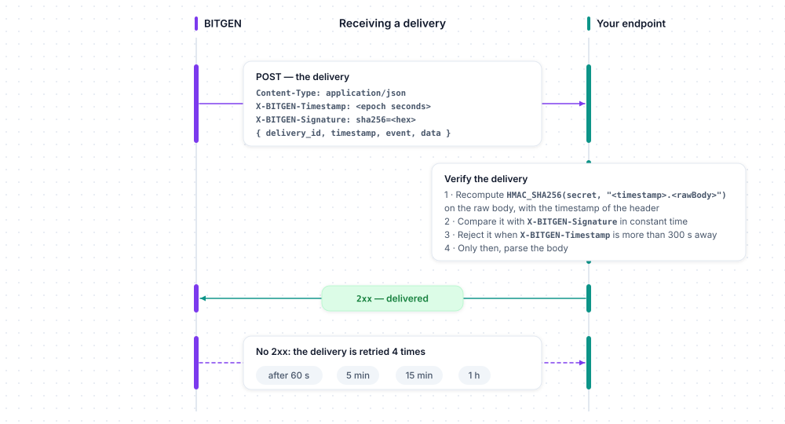

# Webhooks

BITGEN pushes the events of your organization — a customer created, an identity validated, a deposit credited, a withdrawal sent, an order executed, a compliance alert… — to an HTTPS endpoint of yours, each delivery signed with a secret shared with you. `$client->webhooks` sets up that endpoint and its secret, subscribes your organization to the events of the catalogue, reads the delivery logs, and verifies the deliveries your endpoint receives with `verify`.

Examples use `$client`, a configured `BitgenClient` ([Configuration](../configuration.md)). Wherever the API expects your organization, the SDK sends the `scope` of the client.



## Methods

| Method | What it does | Returns |
|---|---|---|
| `activate($endpoint)` | Activates the webhooks of your organization: sets the endpoint, generates the secret | `void` |
| `updateEndpoint($endpoint)` | Changes the endpoint | `void` |
| `regenerate()` | Generates a new secret | `void` |
| `list($includeArchived = null)` | Reads the secret, the endpoint and the subscriptions of your organization | `WebhookSubscriptions` |
| `subscribe($event)` | Subscribes your organization to an event of the catalogue | `Created` (subscription) |
| `archive($subscriber)` | Archives a subscription: the event is no longer delivered | `void` |
| `reactivate($subscriber)` | Reactivates an archived subscription | `void` |
| `logs($subscriber, ...)` | Lists the delivery attempts of a subscription | `Page<DeliveryLog>` |
| `catalog()` | Lists the events of the catalogue | `Page<WebhookType>` |
| `catalogItem($webhook)` | Reads one event of the catalogue | `WebhookType` |
| `verify($rawBody, $headers, $secret, ...)` | Verifies a delivery received by your endpoint and returns its envelope | `WebhookEvent` |

Models of this resource, under `Bitgen\Sdk\Model`: `WebhookSubscriptions`, `Subscriber`, `WebhookType`, `DeliveryLog`, `WebhookEvent`, `Created` — and the constant classes `WebhookEventName`, `SubscriberState`.

## Activate

```
$client->webhooks->activate(string $endpoint): void
```

| Argument | Type | Description |
|---|---|---|
| `endpoint` | `string` | The URL BITGEN will deliver the events to — `https://` is added when the scheme is missing; `http://` is refused outside a local environment |

```php
<?php

$client->webhooks->activate('https://example.com/bitgen');

$secret = $client->webhooks->list()->secret;   // the initial secret is read with list(): keep it server-side for verify()
```

Activation generates the secret of your organization. `activate` does not return it: the API returns the current secret in `list()` (`secret` property, next to `endpoint` and the subscriptions). Once active, a second activation answers `429 webhook_security_already_enabled`. The API answers with an empty body: the method returns nothing.

## UpdateEndpoint

```
$client->webhooks->updateEndpoint(string $endpoint): void
```

| Argument | Type | Description |
|---|---|---|
| `endpoint` | `string` | The new URL — same rules as `activate` |

```php
<?php

$client->webhooks->updateEndpoint('https://example.com/bitgen/v2');
```

Before activation, the API answers `404 unknown_webhook_security`. The method returns nothing.

## Regenerate

```
$client->webhooks->regenerate(): void
```

```php
<?php

$client->webhooks->regenerate();                 // 1. a new secret is created — it is not returned

$secret = $client->webhooks->list()->secret;   // 2. the new secret — configure your receiving endpoint with it, the previous one stops validating immediately
```

`regenerate()` creates a new secret but does not return it: the API returns the current secret in `list()` (`secret` property, next to `endpoint` and the subscriptions). The deliveries are signed with the new one from then on, the previous one stops validating immediately. Before activation, the API answers `404 unknown_webhook_security`. The method returns nothing.

## List

```
$client->webhooks->list(?bool $includeArchived = null): WebhookSubscriptions
```

| Argument | Type | Description |
|---|---|---|
| `includeArchived` | `?bool` | Also returns the `SubscriberState::ARCHIVED` subscriptions — default `false` ([Query booleans](../concepts.md#query-booleans)) |

```php
<?php

$subscriptions = $client->webhooks->list(includeArchived: true);

foreach ($subscriptions->items as $subscription) {
    echo $subscription->webhook->name, ' ', $subscription->state, PHP_EOL;   // custody.sent ENABLED
}
```

Returns a `WebhookSubscriptions`:

| Property | Description |
|---|---|
| `secret` | The secret of your organization, for `verify` |
| `endpoint` | The URL the events are delivered to |
| `items` | The subscriptions, a list of `Subscriber`: `uuid`, `state` (`SubscriberState::ENABLED` or `SubscriberState::ARCHIVED`), `updatedAt` (epoch seconds), `webhook` (the event of the catalogue, a `WebhookType`: `uuid`, `state` (`SubscriberState` as well), `name`, `label` — its display names, a raw JSON string `{"fr": "…", "en": "…"}` — and `data`, internal) |

Before activation, the API answers `404 unknown_webhook_security`.

## Subscribe

```
$client->webhooks->subscribe(string|WebhookType $event): Created
```

| Argument | Type | Description |
|---|---|---|
| `event` | `string\|WebhookType` | The event, by name (a `WebhookEventName` constant, or any name of the catalogue), by uuid, or as a `WebhookType` returned by `catalog()` |

```php
<?php

use Bitgen\Sdk\Model\WebhookEventName;

$subscription = $client->webhooks->subscribe(WebhookEventName::CUSTODY_SENT);

echo $subscription->uuid, PHP_EOL;
```

Returns a `Created`: the `uuid` of the subscription, for `archive`, `reactivate` and `logs`. A subscription that already exists answers `409 webhook_subscription_already_exists`; an unknown event, `404 unknown_webhook`. The events of the catalogue:

| Family | Events |
|---|---|
| Customers | `user.created`, `user.identity.started`, `user.identity.pending`, `user.identity.step.validated`, `user.identity.step.rejected`, `user.identity.step.requested`, `user.identity.validated`, `user.identity.renew`, `user.identity.request` |
| Organizations | `organization.created`, `organization.identity.started`, `organization.identity.pending`, `organization.identity.step.validated`, `organization.identity.step.rejected`, `organization.identity.step.requested`, `organization.identity.validated`, `organization.identity.renew`, `organization.identity.request` |
| Bank | `bank.credited`, `bank.debited`, `bank.transaction` |
| Custody | `custody.transaction`, `custody.wallet.created`, `custody.sent`, `custody.received` |
| Trading | `trading.buy`, `trading.sell` |
| Staking | `staking.requested`, `staking.status`, `staking.rewards`, `staking.claimed` |
| Compliance | `alert.opened`, `alert.status` |

Each has its `WebhookEventName` constant (`WebhookEventName::CUSTODY_SENT` for `custody.sent`, `WebhookEventName::USER_IDENTITY_STEP_VALIDATED` for `user.identity.step.validated`…); `subscribe` also accepts any other name, as the catalogue may grow, and a `WebhookType` of the catalogue (its uuid is sent).

## Archive

```
$client->webhooks->archive(string|Subscriber $subscriber): void
```

`$subscriber` is the uuid returned by `subscribe`, or a `Subscriber` of `list()`.

```php
<?php

$client->webhooks->archive('SUBSCRIBER_UUID');
```

The subscription becomes `SubscriberState::ARCHIVED`: the event is no longer delivered. An unknown subscription answers `404 unknown_webhook_subscriber`. The method returns nothing.

## Reactivate

```
$client->webhooks->reactivate(string|Subscriber $subscriber): void
```

`$subscriber` is the uuid returned by `subscribe`, or a `Subscriber` of `list()`.

```php
<?php

$client->webhooks->reactivate('SUBSCRIBER_UUID');
```

The subscription becomes `SubscriberState::ENABLED` again. An unknown subscription answers `404 unknown_webhook_subscriber`. The method returns nothing.

## Logs

```
$client->webhooks->logs(string|Subscriber $subscriber, ?int $offset = null, ?int $limit = null): Page<DeliveryLog>
```

`$subscriber` is the uuid returned by `subscribe`, or a `Subscriber` of `list()`.

| Argument | Type | Description |
|---|---|---|
| `offset`, `limit` | `?int` | [Pagination](../concepts.md#pagination) |

```php
<?php

$page = $client->webhooks->logs('SUBSCRIBER_UUID', offset: 0, limit: 50);

foreach ($page->items as $delivery) {
    echo $delivery->date, ' ', $delivery->http_code, ' ', $delivery->attempts, PHP_EOL;   // 1701000000 204 1
}
```

Returns a page of `DeliveryLog` (property names as the API gives them): `date` (epoch seconds), `webhook` (the event name), `url` (the endpoint called), `status` (`SENT` or `FAILED` for that attempt), `http_code` (the status your endpoint answered, or `null`), `duration_ms` (or `null`), `attempts` (attempt number), `payload` (the delivered body, an associative array), `error` (failure reason, `null` on success).

## Catalog

```
$client->webhooks->catalog(): Page<WebhookType>
```

```php
<?php

$catalog = $client->webhooks->catalog();

foreach ($catalog->items as $type) {
    echo $type->name, ' ', $type->state, PHP_EOL;   // custody.sent ENABLED
}
```

Returns every event of the catalogue, `SubscriberState::ARCHIVED` ones included, as `WebhookType`: `uuid`, `state` (`SubscriberState::ENABLED` or `SubscriberState::ARCHIVED`), `name`, `label` (its display names, a raw JSON string `{"fr": "…", "en": "…"}`), `data` (internal, a raw JSON string).

## CatalogItem

```
$client->webhooks->catalogItem(string|WebhookType $webhook): WebhookType
```

`$webhook` is the uuid of the event, or a `WebhookType`.

```php
<?php

$type = $client->webhooks->catalogItem('WEBHOOK_UUID');

echo $type->name, PHP_EOL;   // custody.sent
```

Returns one `WebhookType`; an unknown uuid answers `404 unknown_webhook`.

## Verify

```
$client->webhooks->verify(string $rawBody, array $headers, string $secret, int|float $tolerance = 300): WebhookEvent
```

No request: the verification runs locally, with the secret of your organization.

Each delivery is a `POST` to your endpoint, with `Content-Type: application/json`, a JSON body `{ delivery_id, timestamp, event, data }` and two headers:

| Header | Content |
|---|---|
| `X-BITGEN-Timestamp` | The time of the delivery, epoch seconds |
| `X-BITGEN-Signature` | `sha256=<hex>`, where `hex = HMAC_SHA256(secret, "<timestamp>.<rawBody>")` |

Answer with a 2xx status: a delivery that does not get one is retried 4 times (after 60 s, 5 min, 15 min and 1 h).

| Argument | Type | Description |
|---|---|---|
| `rawBody` | `string` | The body exactly as received — `file_get_contents('php://input')`, never a re-serialized JSON |
| `headers` | `array` | The headers as received: `getallheaders()`, `$_SERVER` (`HTTP_X_BITGEN_…` keys) or a PSR-7 `getHeaders()`; names are matched case-insensitively, a multi-valued header keeps its first value |
| `secret` | `string` | The secret of your organization (`list()->secret`) |
| `tolerance` | `int\|float` | Optional: the maximum distance, in seconds, between now and the timestamp of the delivery — `300` by default, `0` disables the check |

```php
<?php

use Bitgen\Sdk\Exception\BitgenException;
use Bitgen\Sdk\Model\WebhookEventName;

// In your endpoint, the delivery is what PHP received:
//   $rawBody = file_get_contents('php://input');
//   $headers = getallheaders();
// The lines below build one, signed with an example secret, so that this example runs as is.
$secret = 'whsec_9f2c6b1e4d8a7c3b5e0f1a2d4c6b8e9a';   // $client->webhooks->list()->secret, kept server-side
$rawBody = '{"delivery_id":"delivery-1","timestamp":1701000000,"event":"custody.sent","data":{"wallet":"wallet-eth","amount":"0.5"}}';
$timestamp = (string) time();
$headers = ['X-BITGEN-Timestamp' => $timestamp, 'X-BITGEN-Signature' => 'sha256=' . hash_hmac('sha256', $timestamp . '.' . $rawBody, $secret)];

try {
    $event = $client->webhooks->verify($rawBody, $headers, $secret);
    http_response_code(204);   // acknowledge first: a delivery without a 2xx answer is retried
    if ($event->event === WebhookEventName::CUSTODY_SENT) {
        // $event->data is mixed: its shape depends on the event
    }
    echo $event->delivery_id, ' ', $event->event, PHP_EOL;   // delivery-1 custody.sent
} catch (BitgenException $e) {
    http_response_code(400);   // $e->errorCode: invalid_signature, timestamp_expired…
}
```

`verify` recomputes the signature on the raw bytes, compares it with `X-BITGEN-Signature` in constant time, checks `X-BITGEN-Timestamp` against `tolerance`, and only then parses the body. It returns the envelope, a `WebhookEvent` (property names as the API sends them):

| Property | Description |
|---|---|
| `delivery_id` | The delivery |
| `timestamp` | The time of the delivery, epoch seconds |
| `event` | The event name — compare it with the `WebhookEventName` constants |
| `data` | The payload of the event — `mixed`: its shape depends on the event |

A delivery that fails the verification throws a `BitgenException` whose `status` is `0` and whose `errorCode` is one of:

| `errorCode` | Meaning |
|---|---|
| `missing_signature` | No `X-BITGEN-Signature` header |
| `invalid_signature` | The signature does not match the body and the secret |
| `missing_timestamp` | No `X-BITGEN-Timestamp` header, or not a number |
| `timestamp_expired` | The timestamp of the delivery is more than `tolerance` seconds away from now |
| `invalid_payload` | The body is not the JSON envelope |

The SDK is stateless: a delivery may be replayed within the freshness window and verify again — an endpoint that wants to ignore a replay deduplicates on `delivery_id` on its side. The secret never appears in the exception. An argument that is not usable — an empty `rawBody`, an empty `secret`, a negative `tolerance` — throws an `InvalidArgumentException` ([Invalid arguments](../errors.md#invalid-arguments)).

## Errors

In addition to the [common errors](../errors.md#common-errors):

| Status | `errorCode` | Meaning |
|---|---|---|
| `0` | `missing_signature`, `invalid_signature`, `missing_timestamp`, `timestamp_expired`, `invalid_payload` | `verify`: the delivery fails the verification ([verify](#verify)) |
| `400` | `webhook_security_https_required` | `activate`, `updateEndpoint`: an `http://` endpoint outside a local environment |
| `404` | `unknown_webhook_security` | The webhooks of your organization are not activated |
| `404` | `unknown_webhook` | Unknown event |
| `404` | `unknown_webhook_subscriber` | Unknown subscription |
| `409` | `webhook_subscription_already_exists` | `subscribe`: your organization is already subscribed to this event |
| `412` | `organization_not_enabled` | Your organization is closed |
| `422` | `invalid_include_archived` | `includeArchived` is not a boolean value |
| `429` | `webhook_security_already_enabled` | `activate`: the webhooks are already active |

## Related

- [Errors](../errors.md#webhook-verification) — `BitgenException`, `status` `0`
- [Customers](customer.md) — `user.created`, `user.identity.*`
- [Bank accounts](bank.md) — `bank.credited`, `bank.debited`, `bank.transaction`
- [Custody wallets](custody.md) — `custody.wallet.created`, `custody.received`, `custody.sent`, `custody.transaction`
- [Trading](trading.md) — `trading.buy`, `trading.sell`
- [Staking](staking.md) — `staking.requested`, `staking.status`, `staking.rewards`, `staking.claimed`
- [Transactions](transaction.md) — `bank.transaction`, `custody.transaction`, `alert.opened`, `alert.status`
